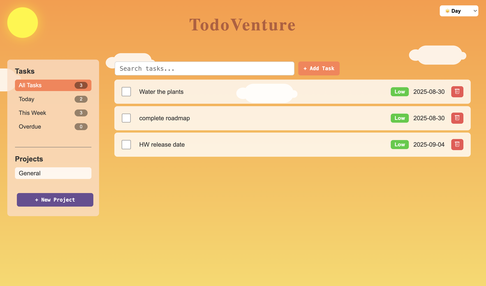
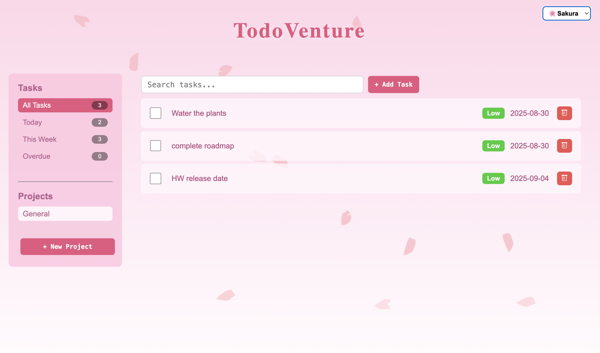

# TodoVenture

TodoVenture started as a small project to get back into web dev.
At some point I went a bit overboard with themes and effects, so it turned into a themed to-do list.

The focus is on keeping the UI friendly and intuitive, while also making the experience a little more fun with different moods.

## Features
- Add, edit, and delete tasks
- Switch between multiple visual themes
- Local storage to keep tasks saved
- Smooth, lightweight animations

## Tech
- HTML, CSS, JavaScript
